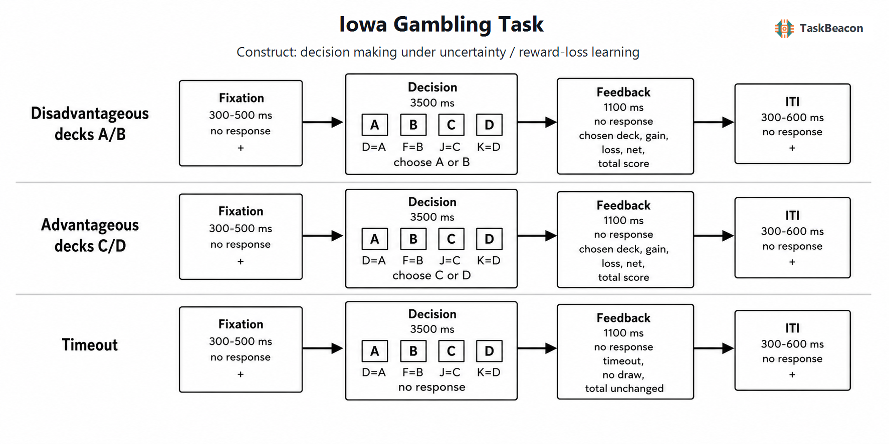

# 爱荷华赌博任务：不确定情境下的经验学习、情感信号与决策测量

现实决策常要求个体在结果概率尚未明示时，依据连续反馈权衡即时收益与长期后果。传统执行功能测验较难同时保留不确定性、动机显著性和跨试次学习，爱荷华赌博任务（Iowa Gambling Task, IGT）由此成为研究经验性价值学习与情感决策的重要范式。IGT 的核心贡献是把选择、即时得失和长期期望值置于同一序列：早期选择发生在模糊性条件下，随着结果累积，参与者逐渐获得关于牌堆的经验，任务遂部分转化为风险条件下的学习。因而，IGT 总分不能被简化为稳定的“风险偏好”；其表现同时受结果频率、损失幅度、工作记忆、反转学习、情感反应和探索—利用策略影响（Dunn et al., 2006; Buelow & Suhr, 2009）。

## 1. 范式提出与理论背景

Bechara 等（1994）最初以腹内侧前额叶损伤者为对象，旨在解释一般智力与常规神经心理测验相对完好时仍可出现的现实决策失调。原始任务给予 2,000 美元模拟本金，要求从外观相同的四个牌堆中连续抽取 100 张牌并尽量增加资产。A、B 每次带来较高即时收益，但每十次选择的累计损失使其长期净值为负；C、D 即时收益较低而长期净值为正。健康对照通常随经验增加对 C、D 的选择，而目标病灶组持续偏向即时高收益牌堆。该结果确立了“对未来后果不敏感”的操作性测量，但病灶效应并非只对应单一情感缺陷：腹内侧前额叶损伤者的部分表现可由反转学习困难解释，背外侧损伤则可能通过工作记忆等不同过程影响任务（Fellows & Farah, 2005）。

躯体标记假说进一步提出，先前选择引发的生理—情感状态可在下一次决策前形成偏置信号。健康参与者在预期选择不利牌堆时出现较强的预期性皮肤电反应，而前额叶损伤者缺少相应分化（Bechara et al., 1996）；随后研究据此主张，有利选择可能先于可明确陈述的规则知识出现（Bechara et al., 1997）。这一解释推动了 IGT 在情感神经科学中的应用，但意识测量时点、规则知识的提问方式及皮肤电分析窗口都会改变结论。元分析显示，不利牌堆相对于有利牌堆的预期性皮肤电差异仅为小效应，且其与最终成绩的方向和稳定性并不一致（Simonovic et al., 2019）。因此，躯体信号是可检验的参与过程，而非 IGT 表现的充分解释。

## 2. 任务逻辑、流程与核心指标

经典 IGT 每一试次先呈现四个牌堆，参与者自由选择其一，继而获得收益及可能同时出现的损失反馈；牌堆保持可选，选择次数而非固定试次编号决定该牌堆下一项结果。A、C 的损失较频繁，B、D 的损失较少但单次幅度较大；A、B 的长期期望值不利，C、D 有利。由此形成两个并不等价的对比：`C+D > A+B` 主要反映长期净值学习，`B+D > A+C` 则反映对低损失频率的偏好。对 B 的持续选择说明，高频净获益可能压过长期期望值，单一净分会掩盖这一策略差异（Lin et al., 2007）。

标准行为指标为总净分 `(C+D)−(A+B)`，常按每 20 试次划分五段以观察学习曲线。更具解释力的报告还应包括四牌堆选择比例、转换/坚持概率、得失后的下一次选择和反应时。早期区段主要包含探索及不确定性降低，后期区段才较接近已学习价值下的选择；把全程合并会混淆学习速度与最终偏好。期望效价、前景效价学习（PVL）和结果表征学习（ORL）等模型试图分解损失厌恶、学习率、记忆衰减、选择一致性及结果频率敏感性。PVL-Delta 能生成部分常见模式，却难覆盖所有不利牌偏好；ORL 通过分别表征收益、损失、频率和坚持倾向改善了多站点数据的预测，但参数解释仍依赖模型恢复与模型比较（Steingroever et al., 2013; Haines et al., 2018）。2025 年引入遗忘与初始选择先验的模型在 504 名健康参与者数据中获得更好拟合，提示未选择牌堆的信息衰减也是序列行为的来源；该结果尚需独立数据和跨版本复现（Yang et al., 2025）。

各阶段对应的心理构念需由具体对比限定。选择前的牌堆停留与反应时可反映价值检索、冲突和反应准备，但同时受空间位置与按键操作影响；选择后的收益—损失反馈提供结果效价、幅度及预测误差，下一试次是否换牌才体现反馈如何更新行为。`损失后换牌 > 收益后换牌` 可检验负性反馈敏感性，仍需控制损失幅度与牌堆基线选择率。分段净分描述行为变化，不能直接识别学习率；模型参数可以提出过程假设，却必须证明参数可恢复且对任务操控具有选择性。

## 3. 行为与神经科学证据

### 3.1 学习、频率与个体差异

健康样本的平均净分通常随试次改善，但“优势学习”并不意味着所有人收敛到 C、D，也不意味着同一净分来自相同过程。即时收益幅度吸引、罕见大损失的低估、牌堆坚持和规则知识均可产生相似总分。情绪状态和人格也能改变牌堆选择，这使 IGT 具有较强的状态敏感性，却削弱其作为单一特质指标的纯度（Buelow & Suhr, 2009）。发展研究进一步表明，趋近有利牌堆与回避不利牌堆呈现不同年龄轨迹；10—30 岁大样本中，趋近行为在青春期中后段达到峰值，而对不利牌堆的回避随年龄线性增强（Cauffman et al., 2010）。年龄差异因此不宜仅解释为总体“决策成熟度”。

临床应用已由局灶性脑损伤扩展至成瘾、赌博障碍和多类精神障碍。酒精使用障碍与赌博障碍的元分析支持群体平均表现较差，但研究间异质性受到任务版本、共病、药物、年龄及计分方式影响（Kovács et al., 2017）。IGT 可用于检验特定群体是否在长期净值学习、损失频率敏感性或坚持倾向上不同；单个低净分既不能定位病理过程，也不足以作出临床诊断。

### 3.2 fMRI 与 EEG 的阶段性证据

事件相关 fMRI 将决策期与结果期分离后发现，IGT 并非由单一“情感脑区”完成。选择及预测误差信号涉及腹内侧与背外侧前额叶、前扣带、岛叶、纹状体和杏仁核等相互作用的系统；工作记忆、注意转换、情感估值和行为更新均参与其中（Li et al., 2010）。另一项研究在预期阶段观察到岛叶与基底节活动，在结果阶段观察到顶叶和额叶活动，并同时发现选择显著受得失频率支配（Lin et al., 2008）。这些 BOLD 差异支持阶段相关的网络参与，不能单独证明某脑区产生躯体标记或因果决定选择。

脑电图（EEG）的时间分辨率有助于区分选择前与反馈后加工。改编 IGT 中，有利与不利牌堆在选择评估阶段引发侧化不同的 P3；反馈相关负波（feedback-related negativity, FRN）主要区分输赢效价，后期 P3 同时受效价和幅度调节（Cui et al., 2013）。近期综述认为，IGT 的 ERP 研究总体支持早期结果评估与较晚注意资源分配的区分，但范式常加入“抽取/跳过”、固定预览或不同反馈时序，成分命名和基线也不一致（Latibeaudiere et al., 2025）。头皮 ERP 适合约束时间进程，不能据此精确定位皮层来源；改编版结果亦不能无条件外推至经典自由选择 IGT。

## 4. 方法发展与主要应用

IGT 的发展主要沿三条方向推进。第一，改动牌堆频率与幅度、加入抽取/跳过条件，以分离收益学习和惩罚学习。第二，保留逐试次数据并使用强化学习模型，避免将不同策略压缩为净分。第三，通过病灶、皮肤电、fMRI 和 EEG 对选择前预期、反应选择与反馈评价进行阶段分离。上述改动提高了构念可识别性，同时产生版本依赖：修改牌堆结构、明确概率、增加反应期限或给出策略提示，都会改变模糊性、学习负荷和动机显著性。

计算建模为个体差异研究提供了更细指标，但并不自动解决测量问题。2022 年研究在相隔一个月的两次测量中发现，传统优势牌比例的重测相关为中等水平，而在完整生成式层级模型下，ORL 参数的相关明显提高；样本仅 50 人，改进同时依赖模型假设和收缩估计（Sullivan-Toole et al., 2022）。抽取/跳过版本的近期重测研究也显示，多数传统与模型指标具有一定稳定性，但第二次测量存在学习变化，且该版本尚需进一步效度检验（Haynes et al., 2024）。这类进展支持把 IGT 用作过程测量，而不是把模型参数直接视为无误差的个体特质。

## 5. 测量效度与解释边界

IGT 具有明确的神经心理学敏感性和较高的生态表面效度，但其构念效度受到任务复合性的限制。风险偏好、模糊性耐受、强化学习、反转学习、工作记忆、频率偏差和运动反应均影响成绩；不同过程可能形成相同净分，不同计分指标也可能给出不同个体排序。传统净分的内部一致性与重测信度通常有限，群体层面稳定的学习曲线不保证个体差异可靠。跨任务相关偏低也意味着 IGT 不应被视为一般“风险承担”的替代量表（Schmitz et al., 2020）。

研究设计应预先区分验证性主指标与探索性过程指标，至少报告逐牌堆行为和分段学习曲线；若使用计算模型，应进行参数恢复、模型恢复和后验预测检验。重复测量需考虑熟悉化导致的策略迁移，临床比较需控制一般认知、药物和共病。因真实金钱、模拟分数、指导语、反馈呈现和试次数均会改变动机与学习，跨研究比较应以具体版本为单位。现有证据支持 IGT 作为不确定条件下经验学习的多过程探针，尚不足以把单次总分解释为稳定人格、局部脑功能或临床诊断。

效度判断还应区分“能否检出已知群体差异”与“能否准确测量个体过程”。病灶组或临床组的平均差异构成已知组效度证据，但若组内净分的重测排序不稳定，该指标仍不适合预测个体结局。类似地，优势牌选择增加可证明参与者对当前收益表有所学习，却不能证明其获得了完整的显性规则知识。将自陈知识、逐试次选择、生理信号和模型参数联合分析，较单独依赖净分更有助于排除频率偏好、规则发现和情感反应之间的替代解释。

## 6. TaskBeacon 中的任务实现

### 6.1 任务资源与访问入口

| 资源 | ID | 用途 | 地址 |
|---|---|---|---|
| 完整实验实现 | T000030 | 中文 PsychoPy/PsyFlow 行为采集版本 | [GitHub 源码](https://github.com/TaskBeacon/T000030-iowa-gambling) |
| 浏览器预览 | H000030 | 与主要流程对齐的原型级网页预览 | [GitHub 源码](https://github.com/TaskBeacon/H000030-iowa-gambling) |

T000030 当前版本为中文行为任务，共 2 组、每组 50 试次。H000030 配置同为 100 试次并复用相同牌堆结果序列，但其清单标记为原型级网页预览，不能替代受控实验环境中的完整采集版本。

*图 1. TaskBeacon 当前试次依次包含 300–500 ms 注视、最长 3,500 ms 决策、1,100 ms 反馈及 300–600 ms 试次间隔。D/F/J/K 分别映射 A/B/C/D；A、B 每次收益 100 分且每十次选择累计净损失 250 分，C、D 每次收益 50 分且每十次选择累计净收益 250 分。A、C 为频繁小额损失，B、D 为罕见大额损失。有效选择后呈现牌堆、收益、损失、净变化和累计分；超时不抽牌且总分不变。各牌堆按自身选择次数循环读取固定十项损失序列，不根据参与者表现调整难度。*

### 6.2 实现流程与关键参数

| 要素 | 当前设置 | 解释要点 |
|---|---|---|
| 初始分数与结果 | 2,000 分；固定十次循环序列 | 保留经典长期净值与损失频率对比 |
| 选择与期限 | 四牌堆同时呈现；D/F/J/K；3.5 s | 期限和超时构成经典无期限版本之外的操作 |
| 时序 | 注视 0.3–0.5 s；反馈 1.1 s；ITI 0.3–0.6 s | 支持阶段标记和行为时序分析 |
| 主要记录 | 牌堆、收益、损失、净值、累计分、反应时、超时 | 可计算净分、牌堆偏好及分段学习 |

该实现的控制器维护每个牌堆独立的抽取计数和累计分，不执行基于成绩的自适应滴定。第一组结束时会显示 C+D 选择率、牌堆次数和净变化；指导语还提示部分牌堆“短期收益高但长期可能亏损”。这些信息提高任务透明度，也可能加速对有利牌堆的显性识别，因此与以规则发现为核心的经典 IGT 比较时，应将组间总结和策略提示视为实质性版本差异。现有仓库文件无法确认模拟“元”或分数是否兑换为实际金钱。

## 参考文献

Bechara, A., Damasio, A. R., Damasio, H., & Anderson, S. W. (1994). Insensitivity to future consequences following damage to human prefrontal cortex. *Cognition, 50*(1–3), 7–15. https://doi.org/10.1016/0010-0277(94)90018-3

Bechara, A., Damasio, H., Tranel, D., & Damasio, A. R. (1997). Deciding advantageously before knowing the advantageous strategy. *Science, 275*(5304), 1293–1295. https://doi.org/10.1126/science.275.5304.1293

Bechara, A., Tranel, D., Damasio, H., & Damasio, A. R. (1996). Failure to respond autonomically to anticipated future outcomes following damage to prefrontal cortex. *Cerebral Cortex, 6*(2), 215–225. https://doi.org/10.1093/cercor/6.2.215

Buelow, M. T., & Suhr, J. A. (2009). Construct validity of the Iowa Gambling Task. *Neuropsychology Review, 19*(1), 102–114. https://doi.org/10.1007/s11065-009-9083-4

Cauffman, E., Shulman, E. P., Steinberg, L., Claus, E., Banich, M. T., Graham, S., & Woolard, J. (2010). Age differences in affective decision making as indexed by performance on the Iowa Gambling Task. *Developmental Psychology, 46*(1), 193–207. https://doi.org/10.1037/a0016128

Cui, J.-F., Chen, Y.-H., Wang, Y., Shum, D. H. K., & Chan, R. C. K. (2013). Neural correlates of uncertain decision making: ERP evidence from the Iowa Gambling Task. *Frontiers in Human Neuroscience, 7*, 776. https://doi.org/10.3389/fnhum.2013.00776

Dunn, B. D., Dalgleish, T., & Lawrence, A. D. (2006). The somatic marker hypothesis: A critical evaluation. *Neuroscience & Biobehavioral Reviews, 30*(2), 239–271. https://doi.org/10.1016/j.neubiorev.2005.07.001

Fellows, L. K., & Farah, M. J. (2005). Different underlying impairments in decision-making following ventromedial and dorsolateral frontal lobe damage in humans. *Cerebral Cortex, 15*(1), 58–63. https://doi.org/10.1093/cercor/bhh108

Haines, N., Vassileva, J., & Ahn, W.-Y. (2018). The Outcome-Representation Learning Model: A novel reinforcement learning model of the Iowa Gambling Task. *Cognitive Science, 42*(8), 2534–2561. https://doi.org/10.1111/cogs.12688

Haynes, J. M., Haines, N., Sullivan-Toole, H., & Olino, T. M. (2024). Test-retest reliability of the play-or-pass version of the Iowa Gambling Task. *Cognitive, Affective, & Behavioral Neuroscience, 24*(4), 740–754. https://doi.org/10.3758/s13415-024-01197-6

Kovács, I., Richman, M. J., Janka, Z., Maraz, A., & Andó, B. (2017). Decision making measured by the Iowa Gambling Task in alcohol use disorder and gambling disorder: A systematic review and meta-analysis. *Drug and Alcohol Dependence, 181*, 152–161. https://doi.org/10.1016/j.drugalcdep.2017.09.023

Latibeaudiere, A., Butler, S., & Owens, M. (2025). Decision-making and performance in the Iowa Gambling Task: Recent ERP findings and clinical implications. *Frontiers in Psychology, 16*, 1492471. https://doi.org/10.3389/fpsyg.2025.1492471

Li, X., Lu, Z.-L., D’Argembeau, A., Ng, M., & Bechara, A. (2010). The Iowa Gambling Task in fMRI images. *Human Brain Mapping, 31*(3), 410–423. https://doi.org/10.1002/hbm.20875

Lin, C.-H., Chiu, Y.-C., Cheng, C.-M., & Hsieh, J.-C. (2008). Brain maps of Iowa gambling task. *BMC Neuroscience, 9*, 72. https://doi.org/10.1186/1471-2202-9-72

Lin, C.-H., Chiu, Y.-C., Lee, P.-L., & Hsieh, J.-C. (2007). Is deck B a disadvantageous deck in the Iowa Gambling Task? *Behavioral and Brain Functions, 3*, 16. https://doi.org/10.1186/1744-9081-3-16

Schmitz, F., Kunina-Habenicht, O., Hildebrandt, A., Oberauer, K., & Wilhelm, O. (2020). Psychometrics of the Iowa and Berlin Gambling Tasks: Unresolved issues with reliability and validity for risk taking. *Assessment, 27*(2), 232–245. https://doi.org/10.1177/1073191117750470

Simonovic, B., Stupple, E., Gale, M., & Sheffield, D. (2019). Sweating the small stuff: A meta-analysis of skin conductance on the Iowa gambling task. *Cognitive, Affective, & Behavioral Neuroscience, 19*(5), 1097–1112. https://doi.org/10.3758/s13415-019-00744-w

Steingroever, H., Wetzels, R., & Wagenmakers, E.-J. (2013). Validating the PVL-Delta model for the Iowa gambling task. *Frontiers in Psychology, 4*, 898. https://doi.org/10.3389/fpsyg.2013.00898

Sullivan-Toole, H., Haines, N., Dale, K., & Olino, T. M. (2022). Enhancing the psychometric properties of the Iowa Gambling Task using full generative modeling. *Computational Psychiatry, 6*(1), 189–212. https://doi.org/10.5334/cpsy.89

Yang, T., Xie, C., & Wang, X. (2025). Forgetting phenomena in the Iowa Gambling Task: A new computational model among diverse participants. *Frontiers in Psychology, 16*, 1510151. https://doi.org/10.3389/fpsyg.2025.1510151
